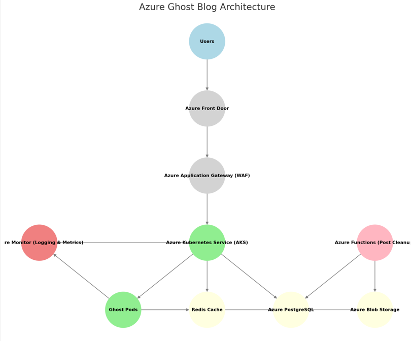

# Drone Shuttles

# Ghost Blog Platform - Proof of Concept

## **1. Architecture Overview**

This Proof of Concept (PoC) deploys the **Ghost Blog platform** on **Azure Kubernetes Service (AKS)**, ensuring *
*scalability, high availability, and resilience**. The architecture is designed to handle sudden traffic spikes, support
multi-region disaster recovery, and facilitate frequent deployments by multiple DevOps teams.

### **Architecture Diagram**

Below is a high-level diagram of the solution:



## **2. Solution Overview**

### **Key Components & Technologies**

- **Azure Front Door**: Global load balancing and traffic routing.
- **Azure Application Gateway (WAF enabled)**: Secure ingress with DDoS protection and SSL termination.
- **Azure Kubernetes Service (AKS)**: Manages Ghost Blog application pods with auto-scaling capabilities.
- **Azure Redis Cache**: Caching layer to optimize performance.
- **Azure PostgreSQL Flexible Server**: Managed database backend for Ghost Blog.
- **Azure Blob Storage**: Stores blog media files.
- **Azure Monitor, Prometheus, Grafana**: Observability stack for logs, metrics, and alerting.
- **Azure Key Vault**: Secure storage for sensitive credentials.
- **Azure Functions (Serverless)**: Implements a function to delete all blog posts when required.

### **Scaling & Resilience**

- **Horizontal Pod Autoscaler (HPA)**: Dynamically adjusts AKS workload based on CPU/memory usage.
- **Multi-Region Deployment**: Supports failover to a secondary Azure region for disaster recovery.
- **Geo-Redundant Storage & Database Backups**: Ensures recovery in case of region-wide failures.

### **CI/CD & Deployment Automation**

- **Infrastructure as Code (Terraform)**: Automates the provisioning of Azure resources.
- **GitHub Actions / Azure DevOps Pipelines**: Implements CI/CD for automated deployment.
- **Helm Charts**: Manages Ghost Blog deployment on Kubernetes.
- **Rolling Updates & Blue/Green Deployments**: Ensures zero downtime during application updates.

### **Security Best Practices**

- **RBAC & Network Policies**: Restricts access based on least privilege principles.
- **Web Application Firewall (WAF) & DDoS Protection**: Safeguards against cyber threats.
- **Audit Logging & Monitoring**: Enables real-time security and compliance visibility.

## **3. Deployment Guide**

### **Pre-requisites**

Ensure the following tools and configurations are set up before deployment:

- An active Azure Subscription
- Terraform installed on your local machine
- Azure CLI configured with appropriate permissions
- Kubectl installed for interacting with the Kubernetes cluster

### **Deployment Steps**

1. **Clone the Repository:**
   ```sh
   git clone <repo-url>
   cd azure-ghost-blog-poc
   ```
2. **Initialize Terraform:**
   ```sh
   terraform init
   ```
3. **Apply Terraform Configuration:**
   ```sh
   terraform apply -auto-approve
   ```
4. **Deploy Ghost Blog on AKS using Helm:**

   ```sh
   helm install ghost ./helm/ghost-chart
   ```

5. **Access the Blog:**

   - Retrieve the public IP of the service:
     ```sh
     kubectl get svc -n ghost
     ```
   - Open the retrieved blog URL in a browser.

## **4. Observability & Monitoring**

To ensure system reliability, the following monitoring tools and techniques are used:

- **Grafana Dashboards**: Provides insights into system health, performance, and alerts.
- **Azure Monitor & Log Analytics**: Centralized logging for debugging and operational visibility.
- **Prometheus Alerts**: Sends real-time notifications in case of failures or anomalies.

## **5. Future Enhancements**

To further improve the solution, the following enhancements are planned:

- Implement CI/CD for database migrations to streamline updates.
- Introduce automated performance testing for better reliability assessment.
- Expand security compliance by integrating additional policies and auditing mechanisms.
